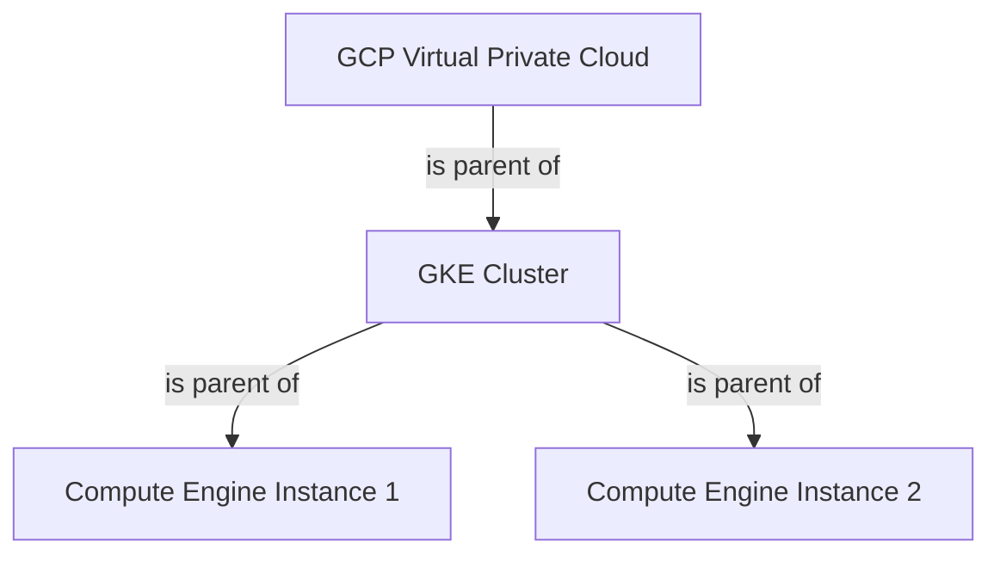

# GCP Assets Input

## What does it do?

The GCP Assets Input collects data about Google Cloud Platform (GCP) resources and their relationships to each other.

Information about the following resources is currently collected:

- Compute Engine instances
- Google Kubernetes Engine (GKE) clusters

These resources are related by a hierarchy of parent/child relationships:



## Configuration

```yaml
assetbeat.inputs:
  - type: assets_gcp
    regions:
        - <region>
    projects:
        - <project> 
    credentials_file_path: "/path/cred-filename.json" 
```

The GCP Assets Input supports the following configuration options plus the [Common options](../README.md#Common options).

* `regions`: The list of GCP regions to collect data from.
* `projects`: The list of GCP projects to collect data from.
* `credentials_file_path`: The GCP service account credentials file, which can be generated from the Google Cloud console, ref: https://cloud.google.com/iam/docs/creating-managing-service-account-keys.

## GCP Permissions

The following GCP API permissions are required for the GCP Assets Input to function.

* `compute.instances.list`
* `container.clusters.list`

## Assets schema

### Google Kubernetes Engine clusters

#### Exported fields

| Field                              | Description                                                                                                                                                                      | Example                                                                          |
|------------------------------------|----------------------------------------------------------------------------------------------------------------------------------------------------------------------------------|----------------------------------------------------------------------------------|
| asset.type                         | The type of asset                                                                                                                                                                | `"k8s.cluster"`                                                                  |
| asset.kind                         | The kind of asset                                                                                                                                                                | `"cluster`                                                                       |
| asset.id                           | The id of the GKE cluster                                                                                                                                                        | `"4d0dde3178fb4977b5f38a773e520b7b4aeb0155a0a34f37a84217f19962c222"`             |
| asset.ean                          | the EAN of this specific resource                                                                                                                                                | `"cluster:4d0dde3178fb4977b5f38a773e520b7b4aeb0155a0a34f37a84217f19962c222"` |
| asset.parents                      | The EANs of the hierarchical parents for this specific asset resource. For a GKE cluster, this corresponds to the VPC it is related to                                           | `[ "network:test-vpc" ]`                                                         |
| asset.children                     | The EANs of the hierarchical children for this specific asset resource. For a GKE cluster (in Standard Mode), this corresponds to the Compute Engine instances it is composed of | `["host:3307406948865894335"]`                                   |
| asset.metadata.state               | The state of the GKE cluster                                                                                                                                                     | `"RUNNING"`                                                                      |
| asset.metadata.labels.<label_name> | Any label specified for this cluster                                                                                                                                             | `"my label value"`                                                               |


#### Example

```json
{
    "@timestamp": "2023-05-24T12:11:15.962Z",
    "host": {
      "name": "test"
    },
    "agent": {
      "version": "8.7.0",
      "ephemeral_id": "725b9844-db35-45b3-83d2-1a77a3b3ad90",
      "id": "405043e0-cd6a-4ff4-b3c9-a3d483645ce0",
      "name": "test",
      "type": "assetbeat"
    },
    "asset.children": [
      "host:3307406948865894335",
      "host:8382432097860543989",
      "host:5252379740648465638"
    ],
    "cloud.account.id": "my-project-id",
    "ecs": {
      "version": "8.0.0"
    },
    "asset.metadata.labels.label1": "my label value",
    "asset.metadata.state": "RUNNING",
    "asset.ean": "cluster:4d0dde3178fb4977b5f38a773e520b7b4aeb0155a0a34f37a84217f19962c222",
    "input": {
      "type": "assets_gcp"
    },
    "asset.id": "4d0dde3178fb4977b5f38a773e520b7b4aeb0155a0a34f37a84217f19962c222",
    "asset.parents": [
      "network:test-vpc"
    ],
    "cloud.provider": "gcp",
    "cloud.region": "europe-west1",
    "asset.type": "k8s.cluster",
    "asset.kind": "cluster"
}
```

### Compute Engine instances

#### Exported fields

| Field                              | Description                                                                                                                                        | Example                                      |
|------------------------------------|----------------------------------------------------------------------------------------------------------------------------------------------------|----------------------------------------------|
| asset.type                         | The type of asset                                                                                                                                  | `"gcp.compute.instance"`                     |
| asset.kind                         | The kind of asset                                                                                                                                  | `"host`                                      |
| asset.id                           | The id of the Compute Engine instance                                                                                                              | `"5252379740648465638"`                      |
| asset.ean                          | the EAN of this specific resource                                                                                                                  | `"host:5252379740648465638"` |
| asset.parents                      | The EANs of the hierarchical parents for this specific asset resource. For a Compute Engine instance, this corresponds to the VPC it is related to | `[ "network:test-vpc" ]`                     |
| asset.metadata.state               | The state of the Compute Engine instance                                                                                                           | `"RUNNING"`                                  |
| asset.metadata.labels.<label_name> | Any label specified for this Compute Engine instance                                                                                               | `"my label value"`                           |


#### Example

```json
{
    "@timestamp": "2023-05-24T12:12:13.443Z",
    "asset.metadata.state": "RUNNING",
    "asset.metadata.labels.label1": "my label value",
    "asset.type": "gcp.compute.instance",
    "asset.kind": "host",
    "asset.ean": "host:5252379740648465638",
    "asset.parents": [
      "network:test-vpc"
    ],
    "input": {
      "type": "assets_gcp"
    },
    "ecs": {
      "version": "8.0.0"
    },
    "agent": {
      "id": "405043e0-cd6a-4ff4-b3c9-a3d483645ce0",
      "name": "test",
      "type": "assetbeat",
      "version": "8.7.0",
      "ephemeral_id": "725b9844-db35-45b3-83d2-1a77a3b3ad90"
    },
    "cloud.provider": "gcp",
    "asset.id": "5252379740648465638",
    "cloud.region": "europe-west1",
    "cloud.account.id": "elastic-obs-integrations-dev",
    "host": {
      "name": "test"
    }
}
```

### VPCs

#### Exported fields

| Field                              | Description                                                                                                                                        | Example                         |
|------------------------------------|----------------------------------------------------------------------------------------------------------------------------------------------------|---------------------------------|
| asset.type                         | The type of asset                                                                                                                                  | `"gcp.vpc"`                     |
| asset.kind                         | The kind of asset                                                                                                                                  | `"network"`                     |
| asset.id                           | The id of the Compute Engine instance                                                                                                              | `"5252379740648465638"`         |
| asset.ean                          | the EAN of this specific resource                                                                                                                  | `"gcp.vpc:5252379740648465638"` |


#### Example

```json
{
  "@timestamp": "2023-06-06T10:43:26.585Z",
  "cloud.account.id": "test-project",
  "asset.id": "583649779116735201",
  "ecs": {
    "version": "8.0.0"
  },
  "asset.ean": "gcp.vpc:583649779116735201",
  "input": {
    "type": "assets_gcp"
  },
  "host": {
    "name": "test"
  },
  "agent": {
    "id": "6427b093-afa2-4b1d-9d4a-b3a2273c2719",
    "name": "test",
    "type": "assetbeat",
    "version": "8.7.0",
    "ephemeral_id": "15509c26-f740-4133-9609-9af21430fb97"
  },
  "asset.name": "test-k8s-vpc",
  "asset.kind": "network",
  "cloud.provider": "gcp",
  "asset.type": "gcp.vpc"
}
```

### VPC Subnets

#### Exported fields

| Field                              | Description                                                                                                                                        | Example                            |
|------------------------------------|----------------------------------------------------------------------------------------------------------------------------------------------------|------------------------------------|
| asset.type                         | The type of asset                                                                                                                                  | `"gcp.subnet"`                     |
| asset.kind                         | The kind of asset                                                                                                                                  | `"network"`                        |
| asset.id                           | The id of the Compute Engine instance                                                                                                              | `"5252379740648465638"`            |
| asset.ean                          | the EAN of this specific resource                                                                                                                  | `"gcp.subnet:5252379740648465638"` |


#### Example

```json
{
  "@timestamp": "2023-06-07T10:22:06.476Z",
  "cloud.provider": "gcp",
  "asset.type": "gcp.subnet",
  "asset.id": "8876074353049608900",
  "asset.ean": "gcp.subnet:8876074353049608900",
  "ecs": {
    "version": "8.0.0"
  },
  "host": {
    "name": "test"
  },
  "agent": {
    "id": "6427b093-afa2-4b1d-9d4a-b3a2273c2719",
    "name": "test",
    "type": "assetbeat",
    "version": "8.7.0",
    "ephemeral_id": "8793edb9-4f21-4845-8e3b-965e37d5dc26"
  },
  "asset.kind": "network",
  "asset.name": "test-subnet",
  "input": {
    "type": "assets_gcp"
  },
  "cloud.account.id": "test-project"
}
```