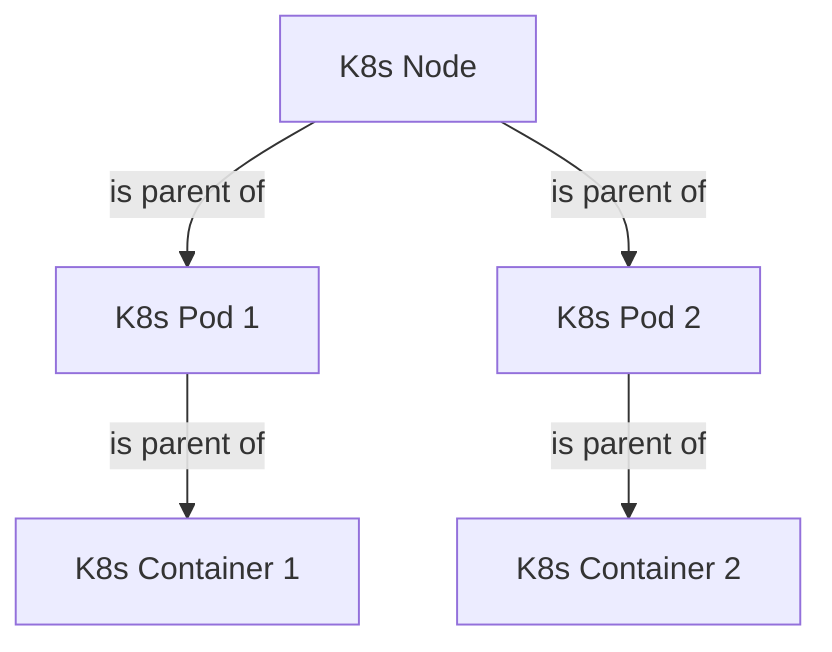

# K8s Assets Input

## What does it do?

The K8s Assets Input collects data about  resources running on a K8s cluster.
Information about the following resources is being collected at the moment:

- K8s Nodes
- K8s Pods
- K8s Containers

These resources are related by a hierarchy of parent/child relationships:



## Configuration

```yaml
assetbeat.inputs:
  - type: assets_k8s
    kube_config:
      - <kube_config>
```

The K8s Assets Input supports the following configuration options plus the [Common options](../README.md#Common options).

* `kube_config`: To ensure that the assetbeat process can collect data, regardless of the environment it runs from, the kube config file path should be configured accordingly. If the assetbeat runs as a pod within the same Kubernetes cluster it needs to collect assets from, the kube_config should be obtained from within the cluster (inClusterconfig). In this case, the kube_config option should be left empty.

## Asset schema

### K8s Nodes

#### Exported fields

| Field                              | Description                                                                                                                                                                     | Example                                                                          |
|------------------------------------|---------------------------------------------------------------------------------------------------------------------------------------------------------------------------------|----------------------------------------------------------------------------------|
| asset.type                         | The type of asset                                                                                                                                                               | `"k8s.node"`                                                                     |
| asset.kind                         | The kind of asset                                                                                                                                                               | `"host`                                                                          |
| asset.id                           | The metadata uid of the kubernetes node                                                                                                                                         | `"0eef8c0d-e6de-4d62-9de5-4d65ae3bfc53"`                                         |
| asset.ean                          | the EAN of this specific resource                                                                                                                                               | `"host:0eef8c0d-e6de-4d62-9de5-4d65ae3bfc53"`                                |
| asset.parents                      | The EAN of the hierarchical parent for this specific asset resource. For a K8s node, this corresponds to the EAN of the k8s.cluster it belongs to in case this information can be retrieved from CSP metadata. | `[ "cluster:3e63bba2eef749e9a120912b8a93023e1f1e545d3f6e4ad6ab14f4654a7c0ef6" ]`                                            |
| cloud.instance.id                  | The ID of the cloud instance. This field is published only in case the K8s node runs inside AWS or GCP cloud.                                                                   | `"4896266826565511097"`                                                          |
| kubernetes.node.name               | The name of the kubernetes node                                                                                                                                                 | `"gke-mytestcluster-te-default-pool-41126842-frw9"`                              |
| kubernetes.node.start_time         | The timestamp when the kubernetes node was created                                                                                                                              | `"2023-05-09T23:38:49Z"`                                                         |

#### Example

```json
{
  "@timestamp": "2023-05-10T13:48:45.430Z",
  "asset.id": "0eef8c0d-e6de-4d62-9de5-4d65ae3bfc53",
  "kubernetes.node.name": "gke-mytestcluster-te-default-pool-41126842-frw9",
  "asset.type": "k8s.node",
  "asset.kind": "host",
  "asset.ean": "host:0eef8c0d-e6de-4d62-9de5-4d65ae3bfc53",
  "kubernetes.node.start_time": "2023-05-09T23:38:49Z",
  "cloud.instance.id": "4896266826565511097",
  "input": {
    "type": "assets_k8s"
  },
  "agent": {
    "id": "eb7b3d8f-acd7-4611-9689-0f4f1fecbeb2",
    "name": "gke-mytestcluster-te-default-pool-41126842-jyae",
    "type": "assetbeat",
    "version": "8.7.0",
    "ephemeral_id": "aa31ac85-e574-46fa-9126-971c0d27175a"
  },
  "ecs": {
    "version": "8.0.0"
  },
  "host": {
    "name": "gke-mytestcluster-te-default-pool-41126842-jyae"
  },
  "asset.parents": [
    "cluster:3e63bba2eef749e9a120912b8a93023e1f1e545d3f6e4ad6ab14f4654a7c0ef6"
  ]
}
```
### K8s Pods

#### Exported fields

| Field                              | Description                                                                                                                                                                     | Example                                                                          |
|------------------------------------|---------------------------------------------------------------------------------------------------------------------------------------------------------------------------------|----------------------------------------------------------------------------------|
| asset.type                         | The type of asset                                                                                                                                                               | `"k8s.pod"`                                                                  |
| asset.kind                         | The kind of asset                                                                                                                                                               | `"container_group`                                                                          |
| asset.id                           | The UID of the kubernetes pod                                                                                                                                                   | `"c8809ae3-ae80-4708-8a9b-fd06f050b881"`             |
| asset.ean                          | the EAN of this specific resource                                                                                                                                               | `"container_group:c8809ae3-ae80-4708-8a9b-fd06f050b881"` |
| asset.parents                      | The EAN of the hierarchical parent for this specific asset resource. For a K8s pod, this corresponds to the EAN of the node it runs on.                                         | `[ "host:33a81d8e-27e4-46cd-abd6-7577fd4d457b" ]`                                            |
| kubernetes.pod.name                | The name of the kubernetes pod                                                                                                                                                  | `"konnectivity-agent-796cb97f7-5xllb"`                                                               |
| kubernetes.pod.uid                 | The UID of the kubernetes pod                                                                                                                                                   | `"c8809ae3-ae80-4708-8a9b-fd06f050b881"`                                                               |
| kubernetes.pod.start_time          | The timestamp when the kubernetes pod started                                                                                                                                   | `"2023-05-09T23:42:10Z"`                                                               |
| kubernetes.namespace               | The kubernetes namespace that the pod belongs to                                                                                                                                | `"kube-system"`                                                               |

#### Example

```json
{
  "@timestamp": "2023-05-25T06:41:46.647Z",
  "asset.type": "k8s.pod",
  "asset.kind": "container_group",
  "kubernetes.pod.start_time": "2023-05-09T23:42:10Z",
  "kubernetes.namespace": "kube-system",
  "agent": {
    "type": "assetbeat",
    "version": "8.7.0",
    "ephemeral_id": "86ed5bd7-d0c3-4953-8b19-7592efd25491",
    "id": "c7014b78-a026-43fe-9450-8347ff731575",
    "name": "gke-mytestcluster-te-default-pool-41126842-frw9"
  },
  "input": {
    "type": "assets_k8s"
  },
  "ecs": {
    "version": "8.0.0"
  },
  "host": {
    "name": "gke-mytestcluster-te-default-pool-41126842-frw9"
  },
  "asset.id": "c8809ae3-ae80-4708-8a9b-fd06f050b881",
  "asset.ean": "container_group:c8809ae3-ae80-4708-8a9b-fd06f050b881",
  "asset.parents": [
    "host:33a81d8e-27e4-46cd-abd6-7577fd4d457b"
  ],
  "kubernetes.pod.name": "konnectivity-agent-796cb97f7-5xllb",
  "kubernetes.pod.uid": "c8809ae3-ae80-4708-8a9b-fd06f050b881"
}
```

### K8s Container

#### Exported fields

| Field                              | Description                                                                                                                                                                     | Example                                                                          |
|------------------------------------|---------------------------------------------------------------------------------------------------------------------------------------------------------------------------------|----------------------------------------------------------------------------------|
| asset.type                         | The type of asset                                                                                                                                                               | `"k8s.container"`                                                                  |
| asset.kind                         | The kind of asset                                                                                                                                                               | `"container`                                                                          |
| asset.id                           | The ID of the kubernetes container                                                                                                                                              | `"f7efd9256b5a6e5fbceb3bdf08e992410ef6652d30483fef3f6c57b162ced3c6"`             |
| asset.ean                          | the EAN of this specific resource                                                                                                                                               | `"container:f7efd9256b5a6e5fbceb3bdf08e992410ef6652d30483fef3f6c57b162ced3c6"` |
| asset.parents                      | The EAN of the hierarchical parent for this specific asset resource. For a container, this corresponds to the EAN of the pod it belongs to.                                     | `[ "container_group:6b27726d-5c68-4d0e-86e3-2ab8344242a0" ]`                                            |
| kubernetes.container.name          | The name of the kubernetes container                                                                                                                                            | `"default-http-backend"`                                                               |
| kubernetes.container.uid           | The ID of the kubernetes container                                                                                                                                              | `"c8809ae3-ae80-4708-8a9b-fd06f050b881"`                                                               |
| kubernetes.container.start_time    | The timestamp that the kubernetes container started                                                                                                                             | `"2023-05-09T23:42:24Z"`                                                               |
| kubernetes.container.state         | The state of the kubernetes container. It can be either "Running", "Waiting" or "Terminated"                                                                                    | `"Running"`                                                               |
| kubernetes.namespace               | The kubernetes namespace that the container belongs to                                                                                                                          | `"kube-system"`                                                               |

#### Example

```json
{
  "@timestamp": "2023-05-25T06:41:46.645Z",
  "asset.ean": "container:f7efd9256b5a6e5fbceb3bdf08e992410ef6652d30483fef3f6c57b162ced3c6",
  "kubernetes.container.uid": "f7efd9256b5a6e5fbceb3bdf08e992410ef6652d30483fef3f6c57b162ced3c6",
  "kubernetes.container.state": "Running",
  "host": {
    "name": "gke-mytestcluster-te-default-pool-41126842-frw9"
  },
  "kubernetes.namespace": "kube-system",
  "input": {
    "type": "assets_k8s"
  },
  "agent": {
    "type": "assetbeat",
    "version": "8.7.0",
    "ephemeral_id": "86ed5bd7-d0c3-4953-8b19-7592efd25491",
    "id": "c7014b78-a026-43fe-9450-8347ff731575",
    "name": "gke-mytestcluster-te-default-pool-41126842-frw9"
  },
  "asset.id": "f7efd9256b5a6e5fbceb3bdf08e992410ef6652d30483fef3f6c57b162ced3c6",
  "kubernetes.container.name": "default-http-backend",
  "kubernetes.container.start_time": "2023-05-09T23:42:24Z",
  "asset.type": "k8s.container",
  "asset.kind": "container",
  "asset.parents": [
    "container_group:6b27726d-5c68-4d0e-86e3-2ab8344242a0"
  ],
  "ecs": {
    "version": "8.0.0"
  }
}
```

## Deploy in a Kubernetes Cluster

In order to deploy assetbeat as a deployment inside a kubernetes cluster
the following steps are needed.

1. Download the manifest file:
```shell 
curl -L -O https://github.com/elastic/assetbeat/blob/main/deploy/assetbeat-kubernetes-manifest.yml`
```
2. Edit the file to adjust `ELASTICSEARCH_USERNAME`, `ELASTICSEARCH_PASSWORD` and `ELASTICSEARCH_PORT` environment variables:
```yaml
env:
      # The basic authentication username used to connect to Elasticsearch
      # This user needs the privileges required to publish events to Elasticsearch.
      - name: ELASTICSEARCH_USERNAME
        value: "elastic"
      # The basic authentication password used to connect to Elasticsearch
      - name: ELASTICSEARCH_PASSWORD
        value: "changeme"
      # The Elasticsearch host to communicate with
      - name: ELASTICSEARCH_HOST
        value: "elasticsearch"
      # The Elasticsearch port to communicate with
      - name: ELASTICSEARCH_PORT
        value: "9200"
```
3. Deploy the assetbeat:
```shell
kubectl create -f assetbeat-kubernetes-manifest.yml
```
4. Check the status:
```shell
kubectl -n kube-system get pods -l k8s-app=assetbeat
```